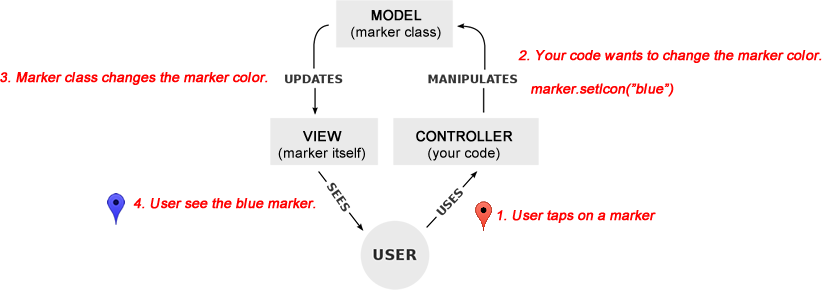

:warning: **This document is aim for older versions (from 2.0.0 to 2.2.9).
Document for new version is https://github.com/mapsplugin/cordova-plugin-googlemaps-doc/blob/master/v2.6.0/README.md**


---------------
# Base class

## Contents

  - <a href="#overview">Overview</a>
    - <a href="#what-is-mvc">What is MVC?</a>
    - <a href="#how-can-i-use-baseclass">How can I use BaseClass?</a>
  - <a href="#api-reference">API Reference</a>

------------
## Overview

The Base class is designed for MVC(Model-View-Controller).
MVC helps you to write your code Model, View and Controller separately.

------------
### What is `MVC`?

`Model-view-contoller (MVC)` is an architectural pattern commonly used for user interface programming.

Let's think about this code. In this code, **you don't know the internal code** how the native API changes the marker color.
**But you only know you can change the marker color** through `marker.setIcon()` method.

```js
marker.addEventListener(plugin.google.maps.event.MARKER_CLICK, function() {

  marker.setIcon('blue');

});
```

The benefit of this architecture is you can separate the code based on the role.

In this code case:
 - `model` is `marker class`, but you don't need to write the code (because this plugin provides it).
 - `view` is `marker` itself.
 - `controller` is your code.



------------

### How can I use `BaseClass`?

- #### Basic usage

  Key-point of the `MVC architecture` is to separate the each code.
  JavaScript in browser uses `event driven` is the most common way.

  For example, `load` event of `Window` object tells you `Window is loaded`.

  ```js
  document.addEventListener(window, 'load', function() {
    console.log('Window is loaded!');
  });
  ```

  Like this, you can use `addEventListener()` and `trigger()`.

  ```js
  var instance = new plugin.google.maps.BaseClass();

  instance.addEventListener('myEvent', function() {
    console.log('myEvent is occurred!');
  });

  instance.trigger('myEvent');
  ```

- #### `set()` and `get()` methods

  The `BaseClass` has `set()` and `get()` methods.
  This is very useful methods.

  If you set a value through `set()` method, you can listen the `(key)_changed` event.

  <a href="mvc_status_change_event.png"></a>

- #### Create your own class

  Some people write like the below code. Well..., it work, but it's kind of `Spaghetti code`.

  ```js
  var cars = [];
  for (var i = 0; i < 10; i++) {
    map.addMarker({
      icon: "car.png",
      position: {lat: ..., lng: ...},
      idx: i
    }, function(marker) {
      marker.addEventListener(plugin.google.maps.event.MARKER_CLICK, function() {
        changeCarPosition(marker.get("idx"));
      });
      cars.push(marker);
    });
  }

  function changeCarColor(index) {
    cars[index].setIcon("blue");
  }
  ```

  `Object-oriented-programming` is a programming paradigm based on the concept of "objects".
  For example, you probably want to write your code in organized files.

  Let's clean up.
  First, create a Car class extends BaseClass.

  ```js
  function Car(marker) {
    BaseClass.apply(this);
    this.set('marker', marker);
    marker.addEventListener(plugin.google.maps.event.MARKER_CLICK, this.setActive);
  }
  Car.prototype = new plugin.google.maps.BaseClass();

  Car.prototype.setActive = function() {
    this.get('marker').setIcon('blue');
  };
  ```

  Second, create instances.
  ```js
  var cars = [];
  for (var i = 0; i < 10; i++) {
    map.addMarker({
      icon: "car.png",
      position: {lat: ..., lng: ...}
    }, function(marker) {
      cars.push(new Car(marker));
    });
  }
  ```

  Ta-da!

  The code for `MARKER_CLICK` goes into the `Car` class.
  You don't need to manage instance by index anymore.
  You can write your `Car` class code into a separate file.

------------
## API reference

### Constructor

<table>
    <tr>
        <th>BaseClass()</th>
        <td>Creates a MVCObject.</td>
    </tr>
</table>

### Methods
<table>
    <tr>
        <th><a href="./addListener/README.md">addListener()</a></th>
        <td>Adds the given listener function to the given event name.</td>
    </tr>
    <tr>
        <th><a href="./addListenerOnce/README.md">addListenerOnce()</a></th>
        <td>Adds the given listener function to the given event name. This event listener works only at once.</td>
    </tr>
    <tr>
        <th><a href="./get_set/README.md">get()</a></th>
        <td>Gets a value.</td>
    </tr>
    <tr>
        <th><a href="./get_set/README.md">set()</a></th>
        <td>Sets a value.</td>
    </tr>
    <tr>
        <th><a href="./removeEventListener/README.md">removeEventListener()</a></th>
        <td>Remove the event listener. If you omit both parameters, all event listeners that added to the object are removed.</td>
    </tr>
    <tr>
        <th>on()</th>
        <td>The same as the <a href="./addListener/README.md">addListener()</a> method.</td>
    </tr>
    <tr>
        <th>one(eventName, callback)</th>
        <td>The same as <a href="./addListenerOnce/README.md">addListenerOnce()</a>.</td>
    </tr>
    <tr>
        <th>off(eventName, callback)</th>
        <td>The same as <a href="./removeEventListener/README.md">removeEventListener()</a>.</td>
    </tr>
    <tr>
        <th><a href="./bindTo/README.md">bindTo(key, target, targetKey, noNotify)</a></th>
        <td>If the value assigned with <span class="highlight">key</span> is changed, the value assigned with <span class="highlight">targetKey</span> also changed.</td>
    </tr>
    <tr>
        <th>empty()</th>
        <td>Clear all stored values</td>
    </tr>
    <tr>
        <th><a href="./trigger/README.md">trigger()</a></th>
        <td>Dispatch an event with given name and parameters.</td>
    </tr>
</table>
