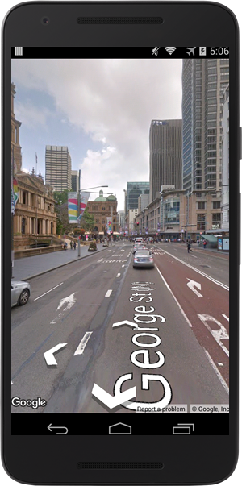
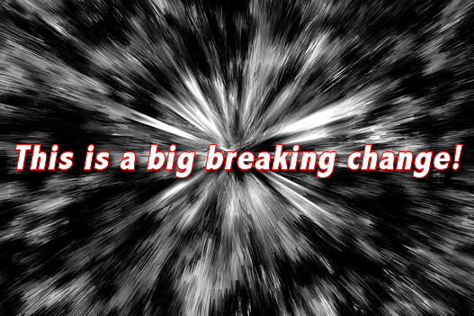

# Release notes version 2.3.0

Featured points
---
- [New feature: StreetView](#new-feature-streetview)
- [A callback is no longer required for the most part.](#a-callback-is-no-longer-required-for-the-most-part)
  - [What’s the trick?](#this-is-a-big-breaking-change)
  - [Which methods are available with this new style?](#which-methods-are-available-with-this-new-style)
- [`Promise` is supported instead of `callback`](#promise-is-supported-instead-of-callback)

------------------------------------------------------------------------

### New feature: StreetView

I am proud to introduce you to a new plugin feature: `StreetView`!
You can create a street view panorama container as well as a map container.

```
var div = document.getElementById("pano_canvas1");
var panorama = plugin.google.maps.StreetView.getPanorama(div, {
  camera: {
    target: {lat: 42.345573, lng: -71.098326}
  }
});
```



---

### A `callback` is no longer required for the most part.



The `cordova-plugin-googlemaps` plugin does not **require** the `callback` anymore with **most of the methods**.

Previously you had to wait for the `MAP_READY` event before you could add a marker like this:

```js
var map = plugin.google.maps.Map.getMap(mapDiv, {
    camera: {
      target: {lat: -33.87365, lng: 151.20689},
      zoom: 16
    }
  });
map.one(plugin.google.maps.event.MAP_READY, function() {

  map.addMarker({
    position: {lat: -33.87365, lng: 151.20689}
  }, function(marker) {
    marker.setAnimation(plugin.google.maps.Animation.BOUNCE);
  });

});
```

Now with version 2.3.0, you can simply write the code like this!

```js
var map = plugin.google.maps.Map.getMap(mapDiv, {
    camera: {
      target: {lat: -33.87365, lng: 151.20689},
      zoom: 16
    }
  });

var marker = map.addMarker({
  position: {lat: -33.87365, lng: 151.20689}
});

marker.setAnimation(plugin.google.maps.Animation.BOUNCE);
```

The coding is simpler now because you can chain methods!

```js
var map = plugin.google.maps.Map.getMap(mapDiv, {
    camera: {
      target: {lat: -33.87365, lng: 151.20689},
      zoom: 16
    }
  });

var marker = map.addMarker({
    position: {lat: -33.87365, lng: 151.20689}
  })
  .setAnimation(plugin.google.maps.Animation.BOUNCE);
```


### What's the trick?

`Map`, `StreetView`, and `Overlays (Marker, Polygon, Polygline, Circle, TileOverlay, and GroundOverlay)` have own internal command queue.
The instance of those classes just stack your statements into the queue when they are fully ready to use, then, it is pulled from the queue and executed.


You can still write your code using the previous `callback` style.
The `callback` is invoked when the instance is fully ready.
_It is the safest way._

```js
map.addMarker({
    position: {lat: -33.87365, lng: 151.20689}
  }, function(marker) {
    // The marker is fully ready.
  });
```

But without the callback, you can write your code simply using ;)
```js
var marker = map.addMarker({
  position: {lat: -33.87365, lng: 151.20689}
});
```

#### Which methods are available with this new style?

  - Map.getMap()
    - you can skip `MAP_READY` event, except if you use `map.getVisibleRegion()`.

  - StreetView.getPanorama()
    - you can skip `PANORAMA_READY` event

  - map.addMarker()
  - map.addCircle()
  - map.addPolygon()
  - map.addPolyline()
  - map.addGroundOverlay()
  - map.addMarkerCluster()
  - map.addTileOverlay()

------------------------------------------------------------------------

### `Promise` is supported instead of `callback`

The most of `setXXXX()` methods work without `callback`.
However if you use `getXXXX()`, you need to pay attention to your code.

For example, the code below returns different value.

**code 1 : incorrect code example**
```js

var visibleRegion1 = map.getVisibleRegion();

map.animateCamera({
  target: {lat: ..., lng: ...},
  zoom: 15
});

var visibleRegion2 = map.getVisibleRegion();

// You may expect `false`, but actually `true`.
// Because this code is executed BEFORE map.animateCamera() is done.
console.log(visibleRegion1.toUrlValue() === visibleRegion2.toUrlValue());
```

**code 2 : correct code example**

```js

var visibleRegion1 = map.getVisibleRegion();

map.animateCamera({
  target: {lat: ..., lng: ...},
  zoom: 15
}, function() {
  // This callback is executed AFTER map.animateCamera() is done.

  var visibleRegion2 = map.getVisibleRegion();

  // Output: `false`
  console.log(visibleRegion1.toUrlValue() === visibleRegion2.toUrlValue());
});

```

Like the above code, if you need to know the status of after statement, you still have to use `callback`.

As of cordova-plugin-googlemaps v2.3.0, you can use `Promise` instead of `callback`.


**code 3 : correct code example with Promise**

```js
var visibleRegion1 = map.getVisibleRegion();

map.animateCamera({
  target: {lat: ..., lng: ...},
  zoom: 15
})
.then(function()) {

  // This callback is executed AFTER map.animateCamera() is done.
  var visibleRegion2 = map.getVisibleRegion();

  // Output: `false`
  console.log(visibleRegion1.toUrlValue() === visibleRegion2.toUrlValue());
});
```

------------------------------------------------------------------------

## logs

- Add: Support `Promise`
- Fix: Touch events bleed through divs to the map when they are animated over the map (#2255)
- Merge pull request (#2245) from TheDuc/multiple_maps - Check whether lastLocation is null before calling getTime()
- Fix: colored icon does not work on Android (#2246)
- Fix: addTileOverlay() does not accept `file://` protocol on iOS
- Fix: (iOS) map.setMyLocationButtonEnabled() does not work
- Fix: (iOS) strange behavior of map.setDiv()
- Add: warning if the div is too small.
- Remove: `Environment.setDebug()`
- Fix: error show htmlinfowindow (#2217)
- Fix: can not load the local KML file if the application name contains space characters.
- Fix: Rebuild tbxml-android.aar (#2215)
- Fix: use "self.exec()" instead of "exec"
- Fix: options.controls.myLocationButton does not work for map.setOptions() (#2209)
- Fix: strange behaviors on Android
- Fix: the values of "makerOptions" variable are not defined as property
- Fix: tiny memory leak point
- Fix: the "type" property should not be lowercase
- Update: Allow remove action before map is ready (#2200)
- Update: positioning mechanism
- Fix: attachToWebView is undefined error
- Fix: putHtmlElements() does not return sometimes
- Fix: HtmlInfoWindow always 80% of the map div width
- Fix: plugin/google/maps/MyPluginLayout.java:463: error: incompatible types: Object cannot be converted to int (#2204)
- Fix: map disappears when the user executes `map.setClickable(false)`
- Fix: the HtmlInfoWindow assigned on the marker of markerCluster does not close the infoWindow.
- Fix: bindTo()
- Fix: Second map is not displayed for some reason
- Fix: map disappears when the user executes `map.setClickable(false)`
- Add: Check the environment at the app starting time even on iOS
- Fix: Application stuck in splash screen after install google maps native (#2191)
- Merge pull request (#2193) from tsbgarner/multiple_maps - Improvements to coordinate precision
- Merge pull request (#2188): from makers-mark/master
- Fix: Ionic: map unexpected animation on tab switching (#2166)
- Fix: getMyLocation don´t work v 2.2.9 (#2183)
- Fix: xml2js error even in v2.2.9 (#2182)
- Fix: remove the _gmaps_cdv_ class on map.remove() even there is another map is displayed
- Fix: incorrect regular expression pattern for iOS Application name
- Merge pull request (#2200): Added exception for remove action before map is ready
- Fix: Typo in MarkerCluster.js (#2198)
