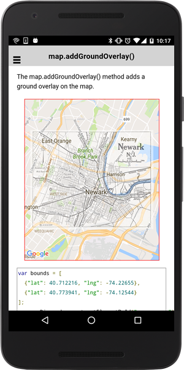

# map.addGroundOverlay()

The map.addGroundOverlay() method adds a ground overlay on the map.

```
(from v2.3.0 to current)
var groundOverlay = map.addGroundOverlay(options)

(from v2.0.0 to current)
map.addGroundOverlay(options, callback);
```

## Options

params         | type          | description
---------------|---------------|---------------------------------------
url            | string        | image url or path
bounds         | ILatLng[2]    | southWest and northEast
anchor         | [x,y]         | (optional) anchor position of bearing. Specify from 0.0 to 1.0
bearing        | number        | (optional) rotate angle. Specify from 0 - 359
opacity        | number        | (optional) opacity from 0.0 to 1.0
zIndex?        | number        | (optional) z-index (default: 0)
clickable?     | boolean       | (optional) set `true` to receive the `CIRCLE_CLICK` event
visible?       | boolean       | (optional) set `false` for invisible
------------------------------------------------------------------------------------------

## Demo code

```html
<div id="map_canvas"></div>
```

```js
var bounds = [
  {"lat": 40.712216, "lng": -74.22655},
  {"lat": 40.773941, "lng": -74.12544}
];
var mapDiv = document.getElementById("map_canvas");
var map = plugin.google.maps.Map.getMap(mapDiv, {
  camera: {
    target: bounds
  }
});

// Add ground overlay
var groundOverlay = map.addGroundOverlay({
  'url': "../images/newark_nj_1922.jpg",
  'bounds': bounds,
  'opacity': 0.5
});

```


