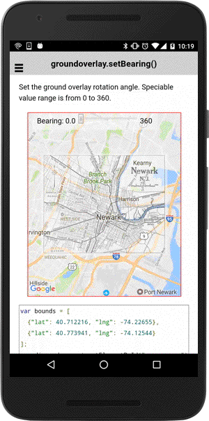

:warning: **This document is aim for older versions (from 2.3.0 to 2.5.3).
Document for new version is https://github.com/mapsplugin/cordova-plugin-googlemaps-doc/blob/master/v2.6.0/README.md**

# groundOverlay.setBearing()

Set the ground overlay rotation angle. The value range is from 0 to 360.

```
groundOverlay.setBearing(bearing);
```


## Parameters

name           | type          | description
---------------|---------------|---------------------------------------
bearing        | number        | new center position
-----------------------------------------------------------------------


## Demo code

```html
<div id="map_canvas">
  <span class="smallPanel">
  Bearing: 0.0&nbsp;<input id="bearingRange" type="range" min="0" max="360" step="10" value="0">&nbsp;360
  </span>
</div>

```js
var bounds = [
  {"lat": 40.712216, "lng": -74.22655},
  {"lat": 40.773941, "lng": -74.12544}
];
var div = document.getElementById("map_canvas");
var map = plugin.google.maps.Map.getMap(div, {
  camera: {
    target: bounds,
    padding: 40
  }
});

// All gestures (such as pinch-zooming) are disabled.
map.setAllGesturesEnabled(false);

// Add ground overlay
var groundOverlay = map.addGroundOverlay({
  'url': "../images/newark_nj_1922.jpg",
  'bounds': bounds,
  'opacity': 0.5
});

var range = document.getElementById("bearingRange");
range.addEventListener("change", function() {

  // Set the ground overlay rotation angle.
  groundOverlay.setBearing(this.value);
});

// Set the current value as rotation angle.
groundOverlay.setBearing(range.value);

```


