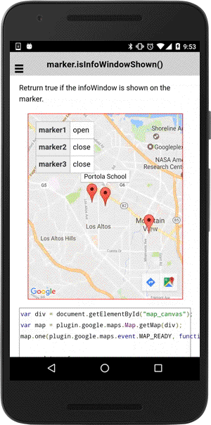

# marker.isInfoWindowShown()

Return true if the infoWindow is shown on the marker.

-----------------------------------------------------------------------

## Demo code

```html
<div id="map_canvas">
    <table style="margin:1em;width:100px;">
      <tr>
        <th>marker1</th>
        <td nowrap id="marker1">close</td>
      </tr>
      <tr>
        <th>marker2</th>
        <td nowrap id="marker2">close</td>
      </tr>
      <tr>
        <th>marker3</th>
        <td nowrap id="marker3">close</td>
      </tr>
    </table>
</div>
```

```js
var div = document.getElementById("map_canvas");
var map = plugin.google.maps.Map.getMap(div);
var data = [
  {
    position: {lng: -122.1180187, lat: 37.3960513},
    title: "Ardis G Egan Intermediate School"
  },
  {
    position: {lng: -122.1102408, lat: 37.3943847},
    title: "Portola School"
  },
  {
    position: {lng: -122.0848257, lat: 37.3818032},
    title: "Isaac Newton Graham Middle School"
  }
];

// Add markers
var bounds = [];
var markers = data.map(function(options, idx) {
  bounds.push(options.position);
  var marker = map.addMarker(options);
  marker.set("label", "marker" + idx);
  marker.on(plugin.google.maps.event.INFO_OPEN, onInfoWindowEvents);
  marker.on(plugin.google.maps.event.INFO_CLOSE, onInfoWindowEvents);
  return marker;
});

// Set camera position that include all markers.
map.moveCamera({
  target: bounds
}, function() {

  // After camera moving, open the last marker.
  markers[markers.length - 1].showInfoWindow();
});

function onInfoWindowEvents(position) {
  var marker = this;
  var labelStr = marker.get("label");
  var label = document.getElementById(labelStr);
  label.innerText = marker.isInfoWindowShown() ? "open" : "close";
}
```


