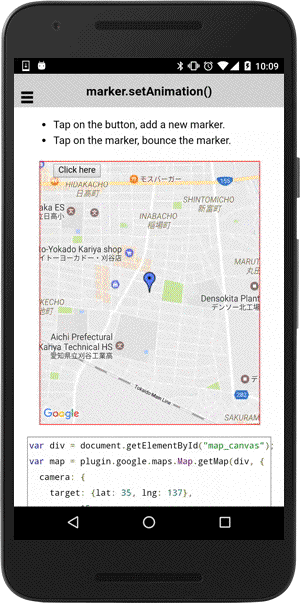

:warning: **This document is aim for older versions (from 2.3.0 to 2.5.3).
Document for new version is https://github.com/mapsplugin/cordova-plugin-googlemaps-doc/blob/master/v2.6.0/README.md**

# marker.setAnimation()

You can give an animation to the marker.

```
marker.setAnimation(animation);
```


## Parameters

<table>
<tr>
  <td>name</td>
  <td>type</td>
  <td>description</td>
</tr>
<tr>
  <td>animation</td>
  <td>string</td>
  <td>One of the following values:
<ul>
  <li>plugin.google.maps.Animation.DROP</li>
  <li>plugin.google.maps.Animation.BOUNCE</li>
</ul>
</td>
</tr>
</table>

-----------------------------------------------------------------------

## Demo code

```html
<div id="map_canvas">
    <span class="smallPanel"><button>Click here</button></span>
</div>
```

```js
var div = document.getElementById("map_canvas");
var map = plugin.google.maps.Map.getMap(div, {
  camera: {
    target: {lat: 35, lng: 137},
    zoom: 15
  }
});


var marker = map.addMarker({
  position: new plugin.google.maps.LatLng(35, 137),
  icon: "https://www.google.com/intl/en_us/mapfiles/ms/icons/blue-dot.png",
  animation: plugin.google.maps.Animation.DROP
});

var button = div.getElementsByTagName('button')[0];
button.addEventListener("click", function() {
  marker.setAnimation(plugin.google.maps.Animation.DROP);
});

marker.on(plugin.google.maps.event.MARKER_CLICK, function() {
  marker.setAnimation(plugin.google.maps.Animation.BOUNCE);
});

```


