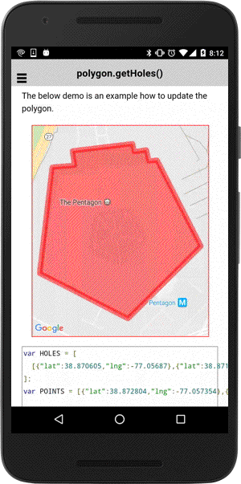

:warning: **This document is aim for older versions (from 2.3.0 to 2.5.3).
Document for new version is https://github.com/mapsplugin/cordova-plugin-googlemaps-doc/blob/master/v2.6.0/README.md**

# polygon.getHoles()


The getHoles() method returns the instance of Array of [BaseArrayClass](../../BaseArrayClass/README.md).

You can modify the array instance using `insertAt()`, `setAt(),
and `removeAt()` methods. The polygon is updated automatically.

```
var holes = polygon.getHoles();
```

------------------------------------------------------------------------------------------

## Demo code

The below demo is an example how to update the polygon.


```html
<div id="map_canvas"></div>
```

```js
var POINTS = [
  {"lat": 38.872804, "lng": -77.057354},
  {"lat": 38.872757, "lng": -77.058101},
  {"lat": 38.869999, "lng": -77.05852},
  {"lat": 38.869689, "lng": -77.057723},
  {"lat": 38.868822, "lng": -77.055574},
  {"lat": 38.870706, "lng": -77.05314},
  {"lat": 38.872939, "lng": -77.054602},
  {"lat": 38.872916, "lng": -77.054878},
  {"lat": 38.873207, "lng": -77.054959},
  {"lat": 38.873156, "lng": -77.055368},
  {"lat": 38.873367, "lng": -77.055418},
  {"lat": 38.87318, "lng": -77.057427}
];

var mapDiv = document.getElementById("map_canvas");

// Create a map with specified camera bounds
var map = plugin.google.maps.Map.getMap(mapDiv, {
  camera: {
    target: POINTS
  }
});

var polygon = map.addPolygon({
  points: POINTS,
  clickable: true // default = false
});

var holes = polygon.getHoles();
var mvcArray = new plugin.google.maps.BaseArrayClass();
holes.push(mvcArray);

polygon.on(plugin.google.maps.event.POLYGON_CLICK, function(latLng) {

  var idx = mvcArray.getLength();
  mvcArray.push(latLng);

  var marker = map.addMarker({
    position: latLng,
    draggable: true
  });
  marker.on("position_changed", function(oldValue, newValue) {
    mvcArray.setAt(idx, newValue);
  });

});

```


