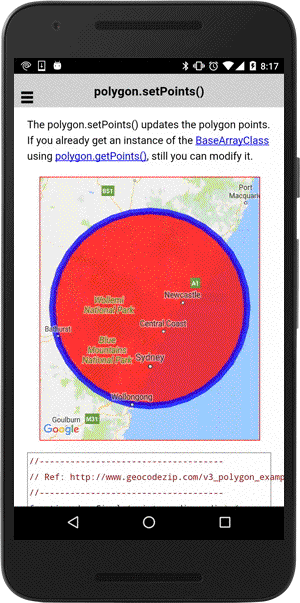

:warning: **This document is aim for older versions (from 2.3.0 to 2.5.3).
Document for new version is https://github.com/mapsplugin/cordova-plugin-googlemaps-doc/blob/master/v2.6.0/README.md**

# polygon.setPoints()

The polygon.setPoints() updates the polygon points.
If you already get an instance of the [BaseArrayClass](../../BaseArrayClass/README.md) using [polygon.getPoints()](../getPoints/README.md), still you can modify it.

```js
polygon.setPoints(points);
```

## Parameters

name           | type          | description
---------------|---------------|---------------------------------------
points         | ILatLng[]     | new points
-----------------------------------------------------------------------

## Demo code

```html
<div class="map" id="map_canvas"></div>
```

```js
//------------------------------------
// Ref: http://www.geocodezip.com/v3_polygon_example_donuta.html
//------------------------------------
function drawCircle(point, radius, dir) {
  var d2r = Math.PI / 180;   // degrees to radians
  var r2d = 180 / Math.PI;   // radians to degrees
  var earthsradius = 3963; // 3963 is the radius of the earth in miles

  var points = 32;

  // find the raidus in lat/lon
  var rlat = (radius / earthsradius) * r2d;
  var rlng = rlat / Math.cos(point.lat * d2r);

  var extp = new Array();
  var start, end;
  if (dir === 1) {
    // one extra here makes sure we connect the
    start = 0;
    end = points + 1;
  } else {
    start = points + 1;
    end = 0;
  }
  for (var i=start; (dir === 1 ? i < end : i > end); i = i + dir) {
    var theta = Math.PI * (i / (points/2));
    ey = point.lng + (rlng * Math.cos(theta)); // center a + radius x * cos(theta)
    ex = point.lat + (rlat * Math.sin(theta)); // center b + radius y * sin(theta)
    extp.push({lat: ex, lng: ey});
  }
  return extp;
}


var mapDiv = document.getElementById("map_canvas");

// Create a map with specified camera bounds
var map = plugin.google.maps.Map.getMap(mapDiv);

// Add a polygon
var polygon = map.addPolygon({
  'points': drawCircle({lat: -33.0, lng: 151.2}, 100, 1),
  'width': 10,
  'geodesic': true,
  'strokeColor': "#0000FF",
  'strokeWeight': 2,
  'fillColor': "#FF0000",
  'clickable': true  //default = false
});

map.moveCamera({
  target: polygon.getPoints().getArray()
});

// Catch the POLYGON_CLICK event
polygon.on(plugin.google.maps.event.POLYGON_CLICK, function() {

  // Set new points
  polygon.setPoints([
    {lat: -32.366418, lng: 151.146957},
    {lat: -32.744884, lng: 150.740298},
    {lat: -32.743724, lng: 150.208911},
    {lat: -33.112183, lng: 150.788921},
    {lat: -33.639087, lng: 150.766192},
    {lat: -33.285082, lng: 151.261255},
    {lat: -33.595936, lng: 151.896088},
    {lat: -33.052976, lng: 151.624838},
    {lat: -32.669338, lng: 152.213894},
    {lat: -32.650729, lng: 151.508452}
  ]);
});

```


