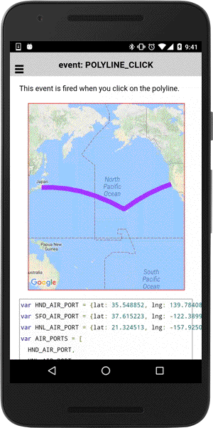

# event: POLYLINE_CLICK

This event is fired when you click on the polyline.

```
polyline.on(plugin.google.maps.event.POLYLINE_CLICK, onPolylineClick);

function onPolylineClick(latLng) {
  var polyline = this;
}
```

## Parameters

name           | type          | description
---------------|---------------|---------------------------------------
latLng         | LatLng        | clicked position
-----------------------------------------------------------------------

## Demo code

```html
<div  id="map_canvas"></div>
```

```js
var HND_AIR_PORT = {lat: 35.548852, lng: 139.784086};
var SFO_AIR_PORT = {lat: 37.615223, lng: -122.389979};
var HNL_AIR_PORT = {lat: 21.324513, lng: -157.925074};
var AIR_PORTS = [
  HND_AIR_PORT,
  HNL_AIR_PORT,
  SFO_AIR_PORT
];

var mapDiv = document.getElementById("map_canvas");

// Create a map with specified camera bounds
var map = plugin.google.maps.Map.getMap(mapDiv, {
  camera: {
    target: AIR_PORTS
  }
});

// Add a polyline
var polyline = map.addPolyline({
  points: AIR_PORTS,
  'color' : '#AA00FF',
  'width': 10,
  'geodesic': true,
  'clickable': true // default = false
});

// Catch the POLYLINE_CLICK event
polyline.on(plugin.google.maps.event.POLYLINE_CLICK, function(latLng) {

  var marker = map.addMarker({
    position: latLng,
    title: "You clicked on the polyline",
    snippet: latLng.toUrlValue(),
    disableAutoPan: true
  });

  marker.showInfoWindow();

});
```


