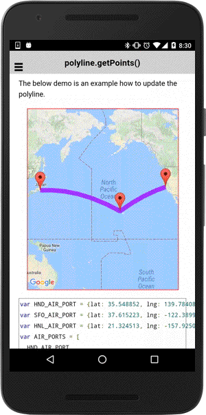

:warning: **This document is aim for older versions (from 2.3.0 to 2.5.3).
Document for new version is https://github.com/mapsplugin/cordova-plugin-googlemaps-doc/blob/master/v2.6.0/README.md**

# polyline.getPoints()

The getPoints() method returns an instance of [BaseArrayClass](../../BaseArrayClass/README.md).
You can modify the array instance using `insertAt()`, `setAt()`, and `removeAt()` methods.
The polyline is updated automatically.

```
var points = polyline.getPoints();
```

------------------------------------------------------------------------------------------

## Demo code

The below demo is an example how to update the polyline.

```html
<div  id="map_canvas"></div>
```

```js
var HND_AIR_PORT = {lat: 35.548852, lng: 139.784086};
var SFO_AIR_PORT = {lat: 37.615223, lng: -122.389979};
var HNL_AIR_PORT = {lat: 21.324513, lng: -157.925074};
var AIR_PORTS = [
  HND_AIR_PORT,
  HNL_AIR_PORT,
  SFO_AIR_PORT
];

var mapDiv = document.getElementById("map_canvas");

// Create a map with specified camera bounds
var map = plugin.google.maps.Map.getMap(mapDiv, {
  camera: {
    target: AIR_PORTS
  }
});

var polyline = addEditablePolygon(map, AIR_PORTS);

function addEditablePolygon(map, points) {

  // Add a polyline
  var polyline = map.addPolyline({
    'points': points,
    'color' : '#AA00FF',
    'width': 10,
    'geodesic': true
  });

  // polyline.getPoints() returns an instance of BaseArrayClass.
  var mvcArray = polyline.getPoints();

  points.forEach(function(point, idx) {
    var marker = map.addMarker({
      position: latLng,
      draggable: true
    });

    marker.on(plugin.google.maps.event.MARKER_DRAG, function(position) {
      mvcArray.setAt(idx, position);
    });

  });

  return polyline;
}
```


