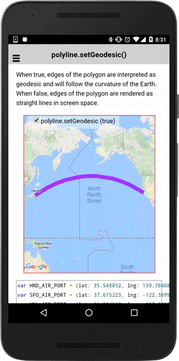

:warning: **This document is aim for older versions (from 2.3.0 to 2.5.3).
Document for new version is https://github.com/mapsplugin/cordova-plugin-googlemaps-doc/blob/master/v2.6.0/README.md**

# polyline.setGeodesic()

When true, edges of the polygon are interpreted as geodesic and will follow the curvature of the Earth. When false, edges of the polygon are rendered as straight lines in screen space.

```js
polygon.setGeodesic(flag);
```


## Parameters

name           | type          | description
---------------|---------------|---------------------------------------
flag           | boolean       | `true`: geodesic, `false`: normal
-----------------------------------------------------------------------

## Demo code

```html
<div  id="map_canvas">
    <span class="smallPanel"><input type="checkbox" id="toggleCheckbox" checked="checked">polyline.setGeodesic (true)</span>
</div>
```

```js
var HND_AIR_PORT = {lat: 35.548852, lng: 139.784086};
var SFO_AIR_PORT = {lat: 37.615223, lng: -122.389979};
var HNL_AIR_PORT = {lat: 21.324513, lng: -157.925074};
var AIR_PORTS = [
  HND_AIR_PORT,
  HNL_AIR_PORT,
  SFO_AIR_PORT
];

var mapDiv = document.getElementById("map_canvas");

// Create a map with specified camera bounds
var map = plugin.google.maps.Map.getMap(mapDiv, {
  camera: {
    target: AIR_PORTS
  }
});

// Add a polyline
var polyline = map.addPolyline({
  points: AIR_PORTS,
  'color' : '#AA00FF',
  'width': 10,
  'geodesic': true
});

var checkbox = document.getElementById("toggleCheckbox");
checkbox.addEventListener("change", function() {

  // Change the geodesic property
  polyline.setGeodesic(checkbox.checked);
});

```


