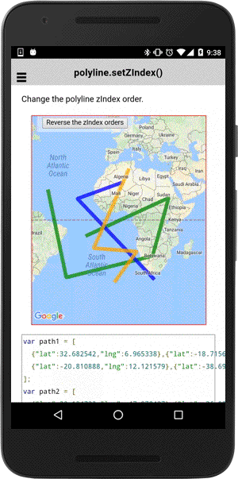

# polyline.setZIndex()

Change the order in which this polyline overlay is drawn with respect to other overlays (including GroundOverlays, TileOverlays, Polygons, and Circles but not Markers).

```
polyline.setZIndex(index);
```

## Parameters

name           | type          | description
---------------|---------------|---------------------------------------
index          | number        | z-index (default: 0)
-----------------------------------------------------------------------

## Demo code

```html
<div id="map_canvas">
  <span class="smallPanel"><button>Reverse the zIndex orders</button></span>
</div>
```

```js
var path1 = [
  {"lat":32.682542,"lng":6.965338},{"lat":-18.715622,"lng":-16.940925},
  {"lat":-20.810888,"lng":12.121579},{"lat":-38.69694,"lng":-2.995607}
];
var path2 = [
  {"lat":20.124723,"lng":-47.878427},{"lat":-36.090536,"lng":-35.456546},
  {"lat":-23.631102,"lng":22.785649},{"lat":14.760725,"lng":33.684091},
  {"lat":-10.790138,"lng":-22.448735}
];
var path3 = [
  {"lat":24.460485,"lng":2.160642},{"lat":14.19339,"lng":-27.956545},
  {"lat":-37.311922,"lng":24.074706}
];

var mapDiv = document.getElementById("map_canvas");

// Create a map with specified camera bounds
var map = plugin.google.maps.Map.getMap(mapDiv);

var colors = ["green", "blue", "orange"];
var pathArray = [path2, path3, path1];
var polylines = pathArray.map(function() {

  // Create polylines
  return map.addPolyline({
    points: path,
    color: colors[idx],
    width: 7,
    zIndex: idx
  });

});

// Change the polyline zIndex orders.
var button = document.getElementsByTagName("button")[0];
button.addEventListener("click", function() {

  polylines = polylines.reverse();
  polylines.forEach(function(polyline, idx) {
    polyline.setZIndex(idx);
  });

});

```


