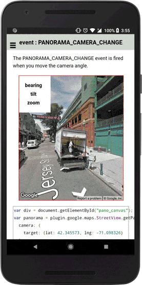

# event: PANORAMA_LOCATION_CHANGE

This event is fired when StreetView panorama is moved.

```
var panorama = plugin.google.maps.StreetView.getPanorama(div);

panorama.moveCamera({
  target: {lat: 42.345573, lng: -71.098326}
});

panorama.on(plugin.google.maps.event.PANORAMA_LOCATION_CHANGE, function(location) {

});
```

## Parameters

name           | type           | description
---------------|----------------|-------------------------------------------------
panoId         | string         | panorama ID that is bounded for a location
latLng         | ILatLng        | position (latitude, longitude)
links          | PanoramaLink[] | References to the next location
----------------------------------------------------------------------------------

## PanoramaLink

name           | type           | description
---------------|----------------|-------------------------------------------------
panoId         | string         | panoId of the next location
bearing        | number         | angle from north (clockwise)
----------------------------------------------------------------------------------


## Demo code

```html
<div class="map" id="pano_canvas">
  <table style="background-color:white; padding: 1em;">
    <tr>
      <th>bearing</th><td id="bearing">&nbsp;</td>
    </tr>
    <tr>
      <th>tilt</th><td id="tilt">&nbsp;</td>
    </tr>
    <tr>
      <th>zoom</th><td id="zoom">&nbsp;</td>
    </tr>
  </table>
</div>
```

```js
var div = document.getElementById("pano_canvas");
var panorama = plugin.google.maps.StreetView.getPanorama(div, {
  camera: {
    target: {lat: 42.345573, lng: -71.098326}
  }
});

var bearingField = document.getElementById('bearing');
var tiltField = document.getElementById('tilt');
var zoomField = document.getElementById('zoom');
panorama.on(plugin.google.maps.event.PANORAMA_CAMERA_CHANGE, function(panoramaCamara) {
  bearingField.innerText = panoramaCamara.bearing.toFixed(0);
  tiltField.innerText = panoramaCamara.tilt.toFixed(0);
  zoomField.innerText = panoramaCamara.zoom.toFixed(0);
});
```


