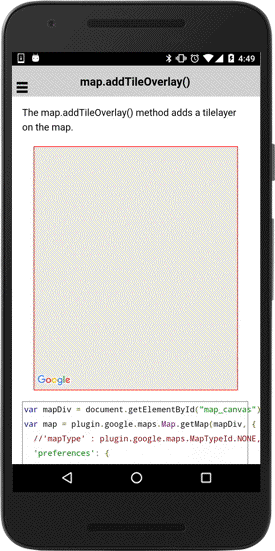

# map.addTileOverlay()

The map.addTileOverlay() method adds a tile layer on the map.

```
(from v2.3.0 to current)
var tileOverlay = map.addTileOverlay(options)

(from v2.0.0 to current)
map.addTileOverlay(options, callback);
```

## Options

params         | type               | description
---------------|--------------------|-----------------------------------------------------------------
getTile        | Function(x,y,zoom) | callback function that returns a tile image url. If return `null`, the tile is not drawn.
opacity?       | number             | (optional) tile image opacity
debug?         | boolean            | (optional) set `true` to draw debug information
visible?       | boolean            | (optional) set `false` to create invisible tile layer
z-index?       | number             | (optional) z-index
-------------------------------------------------------------------------------------------------

**Note**

The default tileSize is now 512px x 512px.
If you use different tile size images, the plugin resizes them automatically.

## Demo code

```html
<div id="map_canvas"></div>
```

```js
var mapDiv = document.getElementById("map_canvas");
var map = plugin.google.maps.Map.getMap(mapDiv, {
  //'mapType' : plugin.google.maps.MapTypeId.NONE,
  'preferences': {
    'zoom': {
      'minZoom': 0,
      'maxZoom': 4
    }
  }
});

var tileOverlay = map.addTileOverlay({
  debug: true,  // draw the debug information on tiles

  opacity: 0.75,  // from 0.0 to 1.0

  // Load image files from the local file path
  getTile: function(x, y, zoom) {
    //return "http://tile.openstreetmap.org/" + zoom + "/" + x + "/" + y + ".png";
    return "../images/map-for-free/" + zoom + "_" + x + "-" + y + ".gif"
  }
});

```


