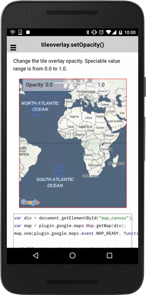

:warning: **This document is aim for older versions (from 2.3.0 to 2.5.3).
Document for new version is https://github.com/mapsplugin/cordova-plugin-googlemaps-doc/blob/master/v2.6.0/README.md**

# tileOverlay.setOpacity()

Change the tile overlay opacity. Available value range is from 0.0 to 1.0.

```
tileOverlay.setOpacity(opacity);
```

## Parameters

name           | type          | description
---------------|---------------|---------------------------------------
opacity        | number        | `0.0`: transparent, `1.0`: visible
-----------------------------------------------------------------------

## Demo code

```html
<div class="map" id="map_canvas">
  <span  class="smallPanel">
    Opacity: 0.0&nbsp;<input id="opacityRange" type="range" min="0" max="1" step="0.1">&nbsp;1.0
  </span>
</div>
```

```js
var div = document.getElementById("map_canvas");
var map = plugin.google.maps.Map.getMap(div);

// All gestures (such as pinch-zooming) are disabled.
map.setAllGesturesEnabled(false);

// Add a tile overlay
var tileOverlay = map.addTileOverlay({
  // &lt;x&gt;,&lt;y&gt; and &lt;zoom&gt; are replaced with values
  // (i.e. http://tile.stamen.com/toner/2/1/2.png)
  getTile: function(x, y, zoom) {
    return "http://tile.stamen.com/toner/" + zoom + "/" + x + "/" + y + ".png";
  }
});

var range = document.getElementById("opacityRange");
range.addEventListener("change", function() {

  // Set the current value as opacity.
  tileOverlay.setOpacity(this.value);
});

// Set the current value as opacity.
tileOverlay.setOpacity(range.value);

```


