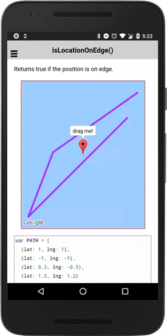

# poly.isLocationOnEdge()

Returns true if the position is on edge.

```
plugin.google.maps.geometry.poly.isLocationOnEdge(position, path);
```

## Parameters

name           | type          | description
---------------|---------------|---------------------------------------
position       | ILatLng       | check position
path           | ILatLng[]     | Array of ILatLng
-----------------------------------------------------------------------

## Demo code

```html
<div  id="map_canvas"></div>
```

```js
var PATH = [
  {lat: 1, lng: 1},
  {lat: -1, lng: -1},
  {lat: 0.3, lng: -0.5},
  {lat: 1.5, lng: 1.2}
];
var mapDiv = document.getElementById("map_canvas");
var map = plugin.google.maps.Map.getMap(mapDiv, {
  'gestures': {
    'scroll': false,
    'tilt': false,
    'rotate': false,
    'zoom': false
  },
  camera: {
    target: PATH
  }
});

// Add polyline
var polyline = map.addPolyline({
  'points': PATH,
  'color' : '#AA00FF',
  'width': 5
});

var marker = map.addMarker({
  'position': (new plugin.google.maps.LatLngBounds(PATH)).getCenter(),
  'draggable': true,
  'title': 'drag me!'
});

// Open the infoWindow
marker.showInfoWindow();

// If the marker position is changed,
// calculates the position is on the edge.
// If on the edge, change the marker color to "blue", otherwise, "red".
marker.on("position_changed", function() {
  var position = marker.getPosition();
  var contain = plugin.google.maps.geometry.poly.isLocationOnEdge(position, PATH);
  marker.setIcon(contain ? "blue" : "red");
});

// Fire the position_changed event for the first calculation
marker.trigger("position_changed", 0, marker.getPosition());
```


