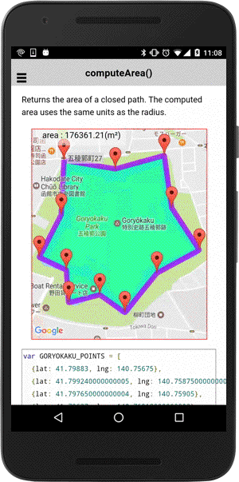

# spherical.computeArea()

Returns the area of a closed path. The computed area uses the same units as the radius.

```
plugin.google.maps.geometry.spherical.computeArea(path);
```

## Parameters

name           | type          | description
---------------|---------------|---------------------------------------
path           | ILatLng[]     | closed path
-----------------------------------------------------------------------

## Demo code

```html
<div id="map_canvas"><span  class="smallPanel" id="label"></span></div>
```

```js
var GORYOKAKU_POINTS = [
  {lat: 41.79883, lng: 140.75675},
  {lat: 41.799240000000005, lng: 140.75875000000002},
  {lat: 41.797650000000004, lng: 140.75905},
  {lat: 41.79637, lng: 140.76018000000002},
  {lat: 41.79567, lng: 140.75845},
  {lat: 41.794470000000004, lng: 140.75714000000002},
  {lat: 41.795010000000005, lng: 140.75611},
  {lat: 41.79477000000001, lng: 140.75484},
  {lat: 41.79576, lng: 140.75475},
  {lat: 41.796150000000004, lng: 140.75364000000002},
  {lat: 41.79744, lng: 140.75454000000002},
  {lat: 41.79909000000001, lng: 140.75465}
];

var mapDiv = document.getElementById("map_canvas");

// Create a map with specified camera bounds
var map = plugin.google.maps.Map.getMap(mapDiv, {
  camera: {
    target: GORYOKAKU_POINTS
  }
});


var label = document.getElementById("label");
var polygon = addEditablePolygon(map, GORYOKAKU_POINTS);

polygon.on("points_changed", function() {
  // Calculate the dimension
  var area = plugin.google.maps.geometry.spherical.computeArea(polygon.getPoints().getArray());
  label.innerText = "area : " + area.toFixed(2) + "(m&sup2;)";
});

polygon.trigger("points_changed");


function addEditablePolygon(map, points) {

  // Add a polygon
  var polygon = map.addPolygon({
    'points': points,
    'strokeColor' : '#AA00FF',
    'fillColor' : '#00FFAA',
    'width': 10
  });

  // polygon.getPoints() returns an instance of the BaseArrayClass.
  var mvcArray = polygon.getPoints();

  // Add draggable markers
  points.forEach(function(latLng, idx) {
    var marker = map.addMarker({
      position: latLng,
      draggable: true
    });

    // If the position property of the marker is updated,
    // a position_changed event is fired.
    marker.on("position_changed", function(oldValue, newValue) {

      // If the mvcArray is updated, the polygon will also be updated.
      mvcArray.setAt(idx, newValue);

      polygon.trigger("points_changed");

    });
  });

  return polygon;
}
```


