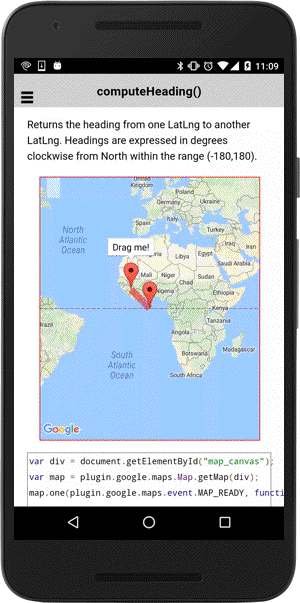

:warning: **This document is aim for older versions (from 2.3.0 to 2.5.3).
Document for new version is https://github.com/mapsplugin/cordova-plugin-googlemaps-doc/blob/master/v2.6.0/README.md**

# spherical.computeHeading()

Returns the heading from one [LatLng](../../../LatLng/README.md) to another [LatLng](../../../LatLng/README.md). Headings are expressed in degrees clockwise from North within the range (-180,180).

```
plugin.google.maps.geometry.spherical.computeHeading(from, to);
```

## Parameters

name           | type          | description
---------------|---------------|---------------------------------------
from           | ILatLng       | origin position
to             | ILatLng       | destination position
-----------------------------------------------------------------------

## Demo code

```html
<div class="map" id="map_canvas">
  <span  class="smallPanel" id="label"></span>
</div>
```

```js
var div = document.getElementById("map_canvas");
var map = plugin.google.maps.Map.getMap(div);

var positions = [
  {"lat": 0, "lng": 0},
  {"lat": 10, "lng": -10}
];

// base marker
var basePosition = positions[0];
map.addMarker({
  'position': basePosition
});


var draggableMarker = map.addMarker({
  'position': positions[1],
  'draggable': true,
  'title': "Drag me!"
});
draggableMarker.showInfoWindow();

var polyline = map.addPolyline({
  "points": positions
});

draggableMarker.on("position_changed", function(oldPosition, newPosition) {
  polyline.getPoints().setAt(1, newPosition);

  // Calculate the heading
  var heading = plugin.google.maps.geometry.spherical.computeHeading(positions[0], newPosition);
  label.innerText = "heading : " + heading.toFixed(0) + "&deg;";
});

```


