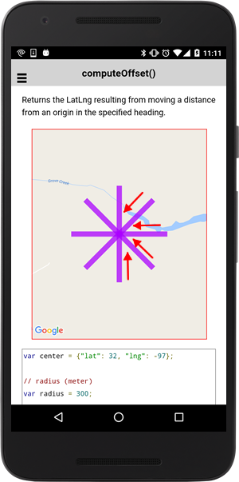

:warning: **This document is aim for older versions (from 2.3.0 to 2.5.3).
Document for new version is https://github.com/mapsplugin/cordova-plugin-googlemaps-doc/blob/master/v2.6.0/README.md**

# spherical.computeOffset()

Returns the [LatLng](../../../LatLng/README.md) resulting from moving a `distance` from an `origin` in the specified `heading`.

```
plugin.google.maps.geometry.spherical.computeOffset(origin, distance, heading);
```

## Parameters

name           | type          | description
---------------|---------------|---------------------------------------
origin         | ILatLng       | from position
distance       | number        | distance in meter
heading        | number        | heading (expressed in degrees clockwise from north)
-----------------------------------------------------------------------

## Demo code

```html
<div id="map_canvas"></div>
```

```js
var center = {"lat": 32, "lng": -97};

// radius (meter)
var radius = 300;

// Calculate the positions
var offsets = [];
for (var degree = 0; degree < 360; degree += 45) {
  offsets.push(plugin.google.maps.geometry.spherical.computeOffset(center, radius, degree));
}

var mapDiv = document.getElementById("map_canvas");
var map = plugin.google.maps.Map.getMap(mapDiv, {
  camera: {
    target: offsets,
    padding: 100
  }
});

offsets.forEach(function(offset) {
  map.addPolyline({
    'points': [center, offset],
    'color' : '#AA00FF'
  });
});

```


