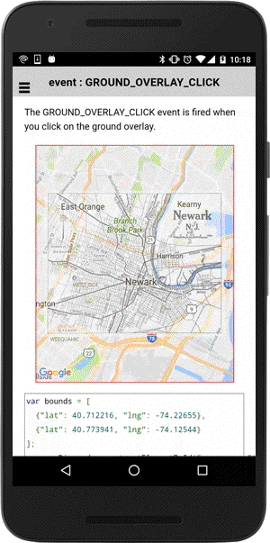

:green_heart: This is the latest document.

# event: GROUND_OVERLAY_CLICK

The GROUND_OVERLAY_CLICK event is fired when you click on the ground overlay.

```
groundOverlay.on(plugin.google.maps.event.GROUND_OVERLAY_CLICK, onGroundOverlayClick);

function onGroundOverlayClick(latLng) {
  var groundOverlay = this;
}
```

## Parameters

name           | type          | description
---------------|---------------|---------------------------------------
latLng         | LatLng        | clicked position
-----------------------------------------------------------------------

## Demo code

```js
<div id="map_canvas"></div>
```

```js
var bounds = [
  {"lat": 40.712216, "lng": -74.22655},
  {"lat": 40.773941, "lng": -74.12544}
];
var mapDiv = document.getElementById("map_canvas");
var map = plugin.google.maps.Map.getMap(mapDiv, {
  camera: {
    target: bounds
  }
});

// Add ground overlay
var groundOverlay = map.addGroundOverlay({
  'url': "../images/newark_nj_1922.jpg",
  'bounds': bounds,
  'opacity': 0.5,
  'clickable': true  // default = false
});

// Catch the GROUND_OVERLAY_CLICK event
groundOverlay.on(plugin.google.maps.event.GROUND_OVERLAY_CLICK, onGroundOverlayClick);

function onGroundOverlayClick(latLng) {

  // Change the opacity of the ground overlay.
  var groundOverlay = this;
  groundOverlay.setOpacity(1.0);

  var marker = map.addMarker({
    position: latLng,
    title: "You clicked here on the ground overlay!",
    snippet: latLng.toUrlValue()
  });
  marker.showInfoWindow();
}
```


