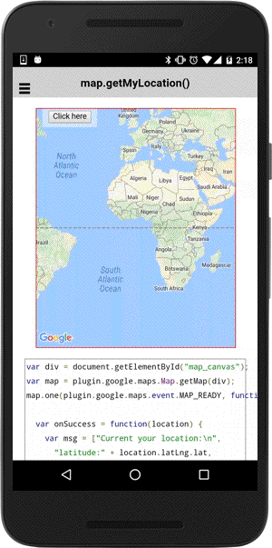

:green_heart: This is the latest document.

# map.getMyLocation()

Get the current device location.

```
map.getMyLocation(options, callback);
```

## Parameters

name      | type                | description
----------|---------------------|----------------------
options   | MyLocationOptions   | position
callback  | Function            | function(location) {}

## MyLocationOptions

name                 | type      | description
---------------------|-----------|----------------------
enableHighAccuracy   | boolean   | Set `true` if you want to try to use GPS mandatory. In `false`, the plugin try to use GPS and network. (default: `false`)
--------------------------------------------------------

## Demo code

```html
<div class="map" id="map_canvas">
    <span class="smallPanel"><button>Click here</button></span>
</div>
```

```js
var div = document.getElementById("map_canvas");
var map = plugin.google.maps.Map.getMap(div);

var onSuccess = function(location) {
  var msg = ["Current your location:\n",
    "latitude:" + location.latLng.lat,
    "longitude:" + location.latLng.lng,
    "speed:" + location.speed,
    "time:" + location.time,
    "bearing:" + location.bearing].join("\n");


  var marker = map.addMarker({
    'position': location.latLng,
    'title': msg
  });
  map.animateCamera({
    target: location.latLng,
    zoom: 16
  }, function() {
    marker.showInfoWindow();
  });
};

var onError = function(msg) {
  alert(JSON.stringify(msg));
};

var button = div.getElementsByTagName('button')[0];
button.addEventListener('click', function() {
  map.clear();
  map.getMyLocation(onSuccess, onError);
});
```


