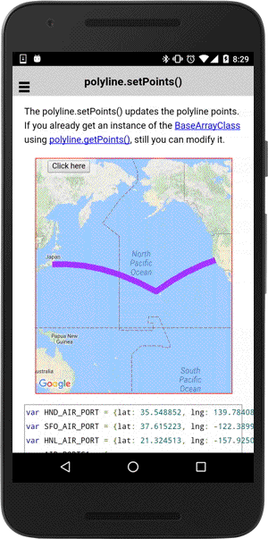

:green_heart: This is the latest document.

# polyline.setPoints()

The polyline.setPoints() updates the polyline points.<br>
If you already get an instance of the [BaseArrayClass](../../BaseArrayClass/README.md) using [polyline.getPoints()](../getPoitns/README.md),
still you can modify it.

```js
polyline.setPoints(points);
```

## Parameters

name           | type          | description
---------------|---------------|---------------------------------------
points         | ILatLng[]     | new points
-----------------------------------------------------------------------

## Demo code

```html
<div id="map_canvas">
  <span class="smallPanel"><button>Click here</button></span>
</div>
```

```js
var HND_AIR_PORT = {lat: 35.548852, lng: 139.784086};
var SFO_AIR_PORT = {lat: 37.615223, lng: -122.389979};
var HNL_AIR_PORT = {lat: 21.324513, lng: -157.925074};
var AIR_PORTS1 = [
  HND_AIR_PORT,
  HNL_AIR_PORT,
  SFO_AIR_PORT
];

var LAX_AIR_PORT = {lat: 33.941589, lng: -118.40853};
var SYD_AIR_PORT = {lat: -33.939923, lng: 151.175276};
var AIR_PORTS2 = [
  SYD_AIR_PORT,
  LAX_AIR_PORT,
  HND_AIR_PORT
];

var mapDiv = document.getElementById("map_canvas");

// Create a map with specified camera bounds
var map = plugin.google.maps.Map.getMap(mapDiv, {
  camera: {
    target: AIR_PORTS1
  }
});

// Add a polyline
var polyline = map.addPolyline({
  'points': AIR_PORTS1,
  'color' : '#AA00FF',
  'width': 10,
  'geodesic': true
});


var button = mapDiv.getElementsByTagName("button")[0];
button.addEventListener("click", function() {

  // Change the polyline points
  polyline.setPoints(AIR_PORTS2);

  map.animateCamera({
    target: AIR_PORTS2
  });

});

```


