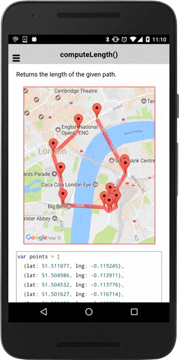

:green_heart: This is the latest document.

# spherical.computeLength()

Returns the length of the given path.

```
plugin.google.maps.geometry.spherical.computeLength(path);
```

## Parameters

name           | type          | description
---------------|---------------|---------------------------------------
path           | ILatLng[]     | path
-----------------------------------------------------------------------

## Demo code

```html
<div id="map_canvas"></div>
```

```js
var points = [
  {lat: 51.511077, lng: -0.119245},
  {lat: 51.504986, lng: -0.113911},
  {lat: 51.504532, lng: -0.113776},
  {lat: 51.501627, lng: -0.116714},
  {lat: 51.501082, lng: -0.115802},
  {lat: 51.500663, lng: -0.115511},
  {lat: 51.500346, lng: -0.116477},
  {lat: 51.500101, lng: -0.116925},
  {lat: 51.50059, lng: -0.117819},
  {lat: 51.500881, lng: -0.125734},
  {lat: 51.504042, lng: -0.126174},
  {lat: 51.50689, lng: -0.127602},
  {lat: 51.509784, lng: -0.122767}
];

var mapDiv = document.getElementById("map_canvas");
var map = plugin.google.maps.Map.getMap(mapDiv, {
  camera: {
    target: points,
    padding : 100
  }
});

map.addPolyline({
  "points": points
});

points.forEach(function(position, idx) {
  var distance = plugin.google.maps.geometry.spherical.computeLength(points.splice(0, idx));
  map.addMarker({
    "position": position,
    "title": "Distance from start : " + distance.toFixed(0) + " m"
  });
});

```


