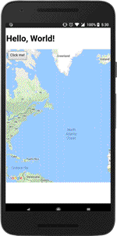

:green_heart: This is the latest document.

# Hello, World

The easiest way to start learning about the cordova-plugin-googlemaps is to create a simple application step by step.

--------------------------------------------

## Step 1: Create an empty project

```
$> cordova -v
9.0.0

$> cordova create HelloMap org.myapp.map HelloMap
Creating a new cordova project.

```

--------------------------------------------

## Step 2: Install the cordova-plugin-googlemaps

```
$> cd HelloMap

$> cordova plugin add cordova-plugin-googlemaps

Adding cordova-plugin-googlemaps to package.json
Saved plugin info for "cordova-plugin-googlemaps" to config.xml

```

--------------------------------------------

## Step 3: Edit `config.xml`

Open the file `config.xml` with your text editor, and write preferences like this.

```xml
<widget ...>
  ...
  <preference name="GOOGLE_MAPS_ANDROID_API_KEY" value="(api key)" />
  <preference name="GOOGLE_MAPS_IOS_API_KEY" value="(api key)" />
  ...
</widget>
```

--------------------------------------------

## Step 4: Add platforms

```
$> cordova platform add android ios
Using cordova-fetch for cordova-android@~8.0.0
Adding android project...
Creating Cordova project for the Android platform:
	Path: platforms/android
	Package: org.myapp.map
	Name: HelloMap
	Activity: MainActivity
	Android target: android-26
Subproject Path: CordovaLib
Subproject Path: app
Android project created with cordova-android@8.0.0
Android Studio project detected
Android Studio project detected
Installing "cordova-plugin-googlemaps" for android
Subproject Path: CordovaLib
Subproject Path: app

            Official document
            https://github.com/mapsplugin/cordova-plugin-googlemaps-doc/blob/master/v2.6.0/README.md

Discovered plugin "cordova-plugin-whitelist" in config.xml. Adding it to the project
Installing "cordova-plugin-whitelist" for android

               This plugin is only applicable for versions of cordova-android greater than 4.0. If you have a previous platform version, you do *not* need this plugin since the whitelist will be built in.

Adding cordova-plugin-whitelist to package.json
Saved plugin info for "cordova-plugin-whitelist" to config.xml
--save flag or autosave detected
Saving android@~8.0.0 into config.xml file ...
Using cordova-fetch for cordova-ios@~5.0.0
Adding ios project...
Creating Cordova project for the iOS platform:
	Path: platforms/ios
	Package: org.myapp.map
	Name: HelloMap
iOS project created with cordova-ios@5.0.0
Installing "cordova-plugin-googlemaps" for ios
Installing "com.googlemaps.ios" for ios

            Official document
            https://github.com/mapsplugin/cordova-plugin-googlemaps-doc/blob/master/v2.6.0/README.md

Installing "cordova-plugin-whitelist" for ios
--save flag or autosave detected
Saving ios@~5.0.0 into config.xml file ...

```

--------------------------------------------

## Step 5: Edit `www/index.html`

Open the file `www/index.html` with your text editor, and replace the whole HTML with the below code.

```html
<!DOCTYPE html>
<html>
  <head>
    <meta name="viewport" content="width=device-width">
    <script type="text/javascript" src="cordova.js"></script>
    <script type="text/javascript">
    document.addEventListener("deviceready", function() {
      var div = document.getElementById("map_canvas");

      // Create a Google Maps native view under the map_canvas div.
      var map = plugin.google.maps.Map.getMap(div);

      // If you click the button, do something...
      var button = document.getElementById("button");
      button.addEventListener("click", function() {

        // Move to the position with animation
        map.animateCamera({
          target: {lat: 37.422359, lng: -122.084344},
          zoom: 17,
          tilt: 60,
          bearing: 140,
          duration: 5000
        });

        // Add a maker
        var marker = map.addMarker({
          position: {lat: 37.422359, lng: -122.084344},
          title: "Welecome to \n" +
                 "Cordova GoogleMaps plugin for iOS and Android",
          snippet: "This plugin is awesome!",
          animation: plugin.google.maps.Animation.BOUNCE
        });

        // Show the info window
        marker.showInfoWindow();

      });

    }, false);

    </script>
    <style type="text/css">
    #map_canvas { /* Must bigger size than 100x100 pixels */
      width: 100%;
      height: 500px;
    }
    button {
      padding: .5em;
      margin: .5em;
    }
    </style>
  </head>
  <body>
    <h1>Hello, World!</h1>
    <div id="map_canvas">
      <button id="button">Click me!</button>
    </div>
  </body>
</html>
```

--------------------------------------------

## Step 6: Run the project!

Connect your Android phone to your pc, and run the project!

```
$> cordova run android
```


--------------------------------------------

## Understanding the code

The code below defines an area of the page for your Google map.

```html
<div id="map_canvas">
  <button id="button">Click me!</button>
</div>
```

In the cordova-plugin-googlemaps, you must set bigger size to it than 100x100 pixels.

```css
#map_canvas { /* Must bigger size than 100x100 pixels */
  width: 100%;
  height: 500px;
}
```

Cordova framework has two sides:

code area  | Description
-----------|-----------------------
JavaScript | Your main code (www/index.html). Easy to understand and run. No compiling is necessary.
Native code| Code is written by native languages, such as Java or Swift. Difficult to understand than JavaScript, but faster than JavaScript.

Cordova framework notifies `deviceready` event when the native code area is ready to use.
You have to start your code from here.

```js
document.addEventListener('deviceready', function() {

  // The cordova-plugin-googlemaps is ready to use.

});
```

The code below constructs a new Google maps object.
At this point in this tutorial, you just see a map.

```js
var div = document.getElementById("map_canvas");

// Create a Google Maps native view under the map_canvas div.
var map = plugin.google.maps.Map.getMap(div);
```



The below code changes the map camera view into particular location.
The `target` property tells the API where to center the map. The map coordinates are set in the order: **latitude, longitude**.

```js
map.animateCamera({
  target: {lat: 37.422359, lng: -122.084344},
  zoom: 17,
  tilt: 60,
  bearing: 140,
  duration: 5000
});
```


The below code puts a marker on the map. This code executes **after the map.animateCamera() is finished**.

```js
// Add a maker
var marker = map.addMarker({
  position: {lat: 37.422359, lng: -122.084344},
  title: "Welecome to \n" +
         "Cordova GoogleMaps plugin for iOS and Android",
  snippet: "This plugin is awesome!",
  animation: plugin.google.maps.Animation.BOUNCE
});

// Show the info window
marker.showInfoWindow();
```

